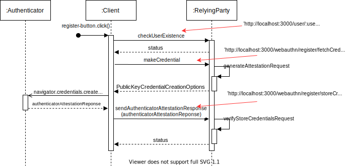

# FIDO2 Server and Client
An implementation of FIDO2 server/client processes.

The purpose of this repo is to clarify how a FIDO2 client and server (referred to as relying party, RP) look like, how they communicate using WebAuthn and what (JSON) objects and parameters are sent from one to the other. 
What happens when a client initiates a registration process? What parameters are sent from the RP to the client? Where and when is WebAuthn API called? These will be answered through code.

This project was heavily influenced by the FIDO Alliance WebAuthn demo https://github.com/fido-alliance/webauthn-demo.

For this implementation we use the express-js framework for the server. For the database we have MongoDB

## Installation and execution

To install and run execute the following commands:

`git clone https://github.com/lefosg/fido2-server-client`
`cd fido2-server-client`
`npm run dev`

The server runs on port `3000`, if this port is used change the `port` variable in `server.js` file.


## WebAuthn Registration
This is an overview of the calls (HTTP requests) in the code during registration <br>
 <br>

The user navigates to the registration form enters a name and clicks register. Note that in our scenario, for demonstration purposes, we allow the user to change attestation type and authenticator attachment.

Upon clicking register a GET request will be made to the endopoint 'http://localhost:3000/user/:username', where ':username' is the username the user gave as input in the form. If the user does not exist (aka status == false), registration is feasible so we proceed.
After that we make a POST request to 'http://localhost:3000/webauthn/register/fetchCredOptions' asking for the **PublicKeyCredentialOptions**. That's the `generateAttestationRequest` operation shown in the diagram above. We must refer to the Relying Party for that because **the Relying Party sets these parameters**. Below we have some sample **PublicKeyCredentialOptions** objects, one from Yubico's website, and one from DuoLabs's.

```js
//The Yubiko sample object is shows strings in Base64 form for readability
var PublicKeyCredentialCreationOptionsYubico = {
    challenge: "qNqrdXUrk5S7dCM1MAYH3qSVDXznb-6prQoGqiACR10=",  //randomly generated, prevents replay attacks, must be signed
    rp: {  //rp info
      id: "demo.yubico.com",
      name: "Yubico Demo"
    },
    user: {  //user handle
      displayName: "Yubico demo user",
      id: "bz9ZDfHzOBLycqISTAdWwWIZt8VO-6mT3hBNXS5jwmY="
    },
    pubKeyCredParams: [
      {
        alg: -7,  //see https://www.iana.org/assignments/cose/cose.xhtml#algorithms full registry
        type: "public-key"
      }
    ],
    publicKey: {
      attestation: "direct",  //if RP cares about registration, enable this flag. Values: none (no attestation), direct (do attestation), indirect (let the authenticator decide)
      authenticatorSelection: {
        authenticatorAttachment: "cross-platform",  //can use any authenticator - platform/roaming
        requireResidentKey: false,  //decide if resident keys will be used or not! Values: true/false 
        userVerification: "discouraged",  //https://developers.yubico.com/WebAuthn/WebAuthn_Developer_Guide/User_Presence_vs_User_Verification.html
        residentKey: 'required'  //this field exists for backwards compatibility reasons
      },
      excludeCredentials: [],  //limit the creation of multiple credentials
      timeout: 30000
    }
};
```

```js
//The duo sample object uses Uint8Arrays (correct form)
var PublicKeyCredentialCreationOptionsDuo = {
    challenge: Uint8Array.from(
        "qNqrdXUrk5S7dCM1MAYH3qSVDXznb-6prQoGqiACR10=", c => c.charCodeAt(0)),
    rp: {
        name: "Duo Security",
        id: "duosecurity.com",
    },
    user: {
        id: Uint8Array.from(
            "UZSL85T9AFC", c => c.charCodeAt(0)),
        name: "lee@webauthn.guide",
        displayName: "Lee",
    },
    pubKeyCredParams: [{alg: -7, type: "public-key"}],
    authenticatorSelection: {
        authenticatorAttachment: "cross-platform",
    },
    attestation: "direct",
    timeout: 60000
};
```

This is how the response should look like in this request. After getting these parameters, the client must now make a call to the authenticator to create the credentials and attestation.

```js
const authenticatorAttestationResponse = await navigator.credentials.create({
    publicKey: PublicKeyCredentialCreationOptionsDuo
})
console.log(authenticatorAttestationResponse);
```

The result of the `console.log(authenticatorAttestationResponse)` should look like that:

```json
{
    "rawId": "Aad50Szy7ZFb8f7wdfMmFO2dUdQB8StMrYBbhJprTCJIKVdbIiMs9dAATKOvUpoKfmyh662ZsO1J5PQUsi9yKNumDR-ZD4wevDYZnwprytGf5rn6ydyxQQtBYPSwS8u23FdVBxBqHa8",
    "id": "Aad50Szy7ZFb8f7wdfMmFO2dUdQB8StMrYBbhJprTCJIKVdbIiMs9dAATKOvUpoKfmyh662ZsO1J5PQUsi9yKNumDR-ZD4wevDYZnwprytGf5rn6ydyxQQtBYPSwS8u23FdVBxBqHa8",
    "response": {
        "attestationObject": "o2NmbXRkbm9uZWdhdHRTdG10oGhhdXRoRGF0YVjszHUM-fXe8fPTc7IQdAU8xhonRmZeDznRqJqecdVRcUNFYfOzo63OAAI1vMYKZIsLJfHwVQMAaAGnedEs8u2RW_H-8HXzJhTtnVHUAfErTK2AW4Saa0wiSClXWyIjLPXQAEyjr1KaCn5soeutmbDtSeT0FLIvcijbpg0fmQ-MHrw2GZ8Ka8rRn-a5-sncsUELQWD0sEvLttxXVQcQah2vpQECAyYgASFYIMG7Y3fOeGecLpfn7XF_sV4OTc41tsbEPSECGfCiK480IlggH9-qVehm6Gj25SyZau17mB5c0YoTWBZ8ngdEka4EqOY",
        "clientDataJSON": "eyJ0eXBlIjoid2ViYXV0aG4uY3JlYXRlIiwiY2hhbGxlbmdlIjoib0dvd2lrQVZHcnZ4Y01uck50ODlCY0dsWnIwVVUwVWxfSm82U0R5RXJrTSIsIm9yaWdpbiI6Imh0dHBzOi8vd2ViYXV0aG53b3Jrcy5naXRodWIuaW8iLCJjcm9zc09yaWdpbiI6ZmFsc2V9"
    },
    "getClientExtensionResults": {},
    "type": "public-key"
}
```
Note: that is a sample response, it is not the one corresponding to the above **PublicKeyCredentialCreationOptions**. Also, the `authenticatorAttestationResponse` is of type *PublicKeyCredential*. 

The `authenticatorAttestationResponse.response.attestationObject` includes the public key material. Next step is to send the `authenticatorAttestationResponse` created above back to the server in order to store it for future authentications. We make a POST request to 'http://localhost:3000/webauthn/register/storeCredentials', where the server gets the **PublicKeyCredential** and runs `verifyStoreCredentialsRequest` on it.

Finally the server responds with a status code of true/false to flag the successful storage of the public key credential in the database

## WebAuthn Authentication

In authentication things are not different. Below we can see a flow of the calls between the client and the server.<br>
 <br>

The user navigates to a login form and enters the account username. A request is made again to the 'http://localhost:3000/user/:username' to check if user exists in the database. Then, client calls `getAssertion` to initiate the actual WebAuthn authentication procedure. The server gets the request and runs `generateAssertionRequest`. This function returns the **PublicKeyCredentialRequestOptions** which looks like this. In authentication the sole purpose is to send the challenge to the client and sign in with the private key, in order to prove ownership. The allowedCredentials is optional and - in descending order - represent a list of acceptable credentials to the caller (i.e., server, see more here: https://www.w3.org/TR/webauthn/#dom-publickeycredentialrequestoptions-allowcredentials).

```js

var PublicKeyCredentialRequestOptions = 
    {
        challenge : randomBase64URLBuffer(32),

        allowCredentials: [
            {  
              id: credentialID,
              type: 'public-key',
              transports: ['usb', 'ble', 'nfc', 'internal']
            }
        ],

        timeout: 100000
    };
```

The client then makes the following call that outputs the **AuthenticatorAssertionResponse** object.

```js
const authenticatorAssertionResponse = await navigator.credentials.create({
    publicKey: PublicKeyCredentialRequestOptions
})
console.log(authenticatorAssertionResponse);

```

The result of the `console.log(authenticatorAssertionResponse)` should look like that:

```json
{
    "rawId": "Aad50Szy7ZFb8f7wdfMmFO2dUdQB8StMrYBbhJprTCJIKVdbIiMs9dAATKOvUpoKfmyh662ZsO1J5PQUsi9yKNumDR-ZD4wevDYZnwprytGf5rn6ydyxQQtBYPSwS8u23FdVBxBqHa8",
    "id": "Aad50Szy7ZFb8f7wdfMmFO2dUdQB8StMrYBbhJprTCJIKVdbIiMs9dAATKOvUpoKfmyh662ZsO1J5PQUsi9yKNumDR-ZD4wevDYZnwprytGf5rn6ydyxQQtBYPSwS8u23FdVBxBqHa8",
    "response": {
        "authenticatorData": "zHUM-fXe8fPTc7IQdAU8xhonRmZeDznRqJqecdVRcUMFYfOzqg",
        "signature": "MEUCIHxzf1KZNJTb831gqw0oit-6ms8DoSXLaM8zyZ4Q6iyjAiEAwbguOZU2iJae_I8-Q7qlFwR45isZ-XYVMDgU2SkABU8",
        "userHandle": "Kosv9fPtkDoh4Oz7Yq_pVgWHS8HhdlCto5cR0aBoVMw",
        "clientDataJSON": "eyJ0eXBlIjoid2ViYXV0aG4uZ2V0IiwiY2hhbGxlbmdlIjoiRjVjSmhMRW00OFNpdGN6MzNiVm51NXpBMmEtRk5MYkxGbURfd1UwT1BIUSIsIm9yaWdpbiI6Imh0dHBzOi8vd2ViYXV0aG53b3Jrcy5naXRodWIuaW8iLCJjcm9zc09yaWdpbiI6ZmFsc2V9"
    },
    "getClientExtensionResults": {},
    "type": "public-key"
}
```
Note: that is a sample response, it is not the one corresponding to the above **PublicKeyCredentialRequestOptions**.

Now, the client must send that object to the server. The server has to validate the signature using the previously stored public key, and send a successful/failed authentication attempt. In the code, the validation process is done in the webauthn route, inside `router.post('/login/verifyAssertion', (req, res) => {...})` function, that's why there is no call visible in the diagram. When the server verifies the signature, it responds with a status message to the client.
